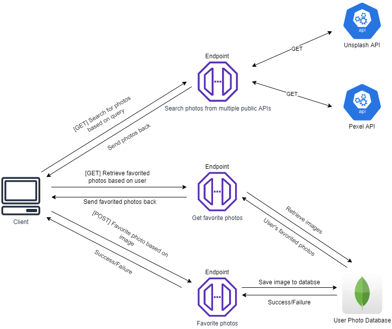

# Project Proposal

## Project Description

As a team of creatives, we set out to build a platform that would find a home in our own daily workflows. We identified a time-consuming task common to us all: finding royalty-free stock images. Services such as Adobe Stock Images provide a paid solution that the majority of amateurs can’t afford, and services such as Unsplash and Pexel aim to fill the void by providing royalty-free stock images at no cost but fall short in their limited selection. Oftentimes, this forces other creatives like us to waste valuable time switching from site to site looking for their desired image, leaving behind a wake of disorganization. Our group looks to make a once-tedious process simple by aggregating images from popular no-cost royalty free stock image sites and providing a hub for users to save or download image collections.

## Technical Description

### Architecture Diagram



### User Stories

|Priority|User|Description|Technical Implementation|
|---|---|---|---|
|P0|As a user|I want to conveniently search free stock images to use for my personal project from multiple popular free stock image websites at once.|When a user searches for a certain image, the input keyword will be passed in as a **query** to multiple **APIs** for different popular websites.|
|P1|As a user|I want to download the image I like from the aggregated search result across different websites.|When a user clicks on the image, the user will be directed to an external website that will let them download the image.|
|P2|As a user|I want to have an account to keep my favorite photos in my personal “favorites” list.|When a user tries to save or like the photo they want to save in their personal list of favorite photos, they will be directed to enter their ID and password to login. They will have different login options such as Google, FB, or etc which will be implemented via **Azure** or **ReactJs**.|
|P3|As a user|I want to save photos I searched for among different websites to my own collection for future reference.|When a user saves a photo he/she likes, it will be saved in **MongoDB** as an external storage to get back to it later and easily download it again as well.|

### Endpoints

#### Search for photos
- **Use Case:** User queries photos based on search/query parameters.
- **Type:** GET
- **Return:** JSON
- Returns list of photos in JSON format based on search parameters including link.

#### Register/login
- **Use Case:** User registers or logs in with a username and receives a JSON response and creates a logged in session.
- **Type:** POST
- **Endpoint:** /users
- **Parameters:** Body parameter of `username`.
- **Return:** JSON
- **Example Request:** <br>
URL: /users <br>
Body:
```json
{
    "username": "uwstudent"  
}
```
- **Example Response:** <br>
```json
{
    "status": "success"  
}
```
- **Error Handling:**
  - **400:** Missing username
  - **500:** Server Error
  - **200:** If user is already logged in with response:
  ```json
  {
      "status": "already logged in"
  }
  ```

#### Log out
- **Use Case:** User logs out of their account if they are logged in, destroying any existing log in sessions.
- **Type:** GET
- **Endpoint:** /users/logout
- **Parameters:** None
- **Return:** Plain text
- **Example Response:** "logged out"

#### Favorite image
- **Use Case:** Favorites an image to a user's account if they are logged in.
- **Type:** POST
- **Endpoint:** /users/favorites
- **Parameters:** Body parameters of `name` and `url`
- **Return:** JSON
- **Example Request:** <br>
Body:
```json
{
    "name": "square",
    "url": "https://upload.wikimedia.org/wikipedia/commons/thumb/d/dd/Square_-_black_simple.svg/1200px-Square_-_black_simple.svg.png"  
}
```
- **Example Response:**
```json
{
  "status": "success"  
}
```
- **Error Handling:**
  - **400:** Not logged in or missing parameters
  - **500:** Server Error

#### Retrieve favorited images
- **Use Case:** Retrieves a user's favorited images if they are logged in.
- **Type:** GET
- **Endpoint:** /users/favorites
- **Parameters:** None
- **Return:** JSON
- **Example Response:**
```json
{
    "favorites": [
        {
            "name": "circle",
            "url": "https://upload.wikimedia.org/wikipedia/commons/thumb/a/a0/Circle_-_black_simple.svg/640px-Circle_-_black_simple.svg.png",
            "date": "2021-11-29T04:07:22.779Z",
            "_id": "61a451fa94404fac6c881fd3"
        },
        {
            "name": "square",
            "url": "https://upload.wikimedia.org/wikipedia/commons/thumb/d/dd/Square_-_black_simple.svg/1200px-Square_-_black_simple.svg.png",
            "date": "2021-11-29T04:35:26.541Z",
            "_id": "61a4588eb3a100b54680d559"
        }
    ]
}
```
- **Error Handling:**
  - **400:** Not logged
  - **500:** Server Error

#### Remove favorited image
- **Use Case:** Removes an image based on name and url from a user's favorited images if they are logged in.
- **Type:** DELETE
- **Endpoint:** /users/favorites
- **Parameters:** Query parameters of `name` and `url`
- **Return:** JSON
- **Example Request:** /users/favorites?name=square&url=https://upload.wikimedia.org/wikipedia/commons/thumb/d/dd/Square_-_black_simple.svg/1200px-Square_-_black_simple.svg.png
- **Example Response:**
```json
{
  "status": "success"  
}
```
- **Error Handling:**
  - **400:** Not logged or missing parameters
  - **500:** Server Error

#### Retrieve user authentication from Microsoft Identity Express
- **Use Case:** User tries to login to his/her personal account to access their "favorites" lists.
- **Type:** GET/POST
- **Return:** Personalized Session Token

### Database Schema

#### Users

|Name|Type|Description|
|---|---|---|
|username|String|Username of user|
|favorites|Array(Image)|List of favorited images|

#### Image

|Name|Type|Description|
|---|---|---|
|name|String|Image name|
|url|String|Image url|
|date|Date|Date of when the image was favorited|

#### Example

```json
  username: "uwstudent"
  favorites: [
    {
      "name": "circle",
      "url": "https://upload.wikimedia.org/wikipedia/commons/thumb/a/a0/Circle_-_black_simple.svg/640px-Circle_-_black_simple.svg.png",
      "date": "2021-11-29T04:07:22.779Z"
    },
    {
      "name": "square",
      "url": "https://upload.wikimedia.org/wikipedia/commons/thumb/d/dd/Square_-_black_simple.svg/1200px-Square_-_black_simple.svg.png",
      "date": "2021-11-29T04:35:26.541Z"
    }
  ]
```
